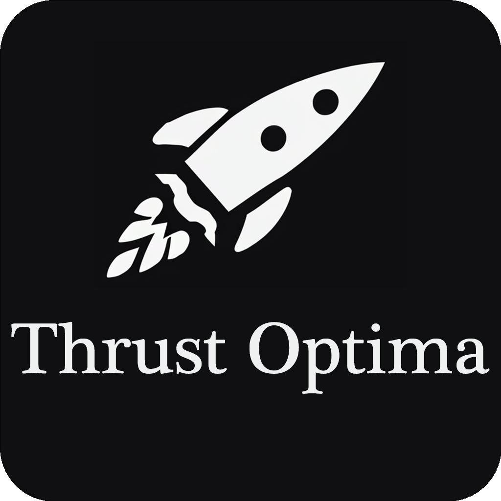

# ThrustOptima
>By [Adam Ousmer](https://github.com/AdamOusmer) for [Space Concordia - Rocketry Division](https://spaceconcordia.ca/rocketry)

 

## Project Status
> _**PROJECT IN DEVELOPMENT**_

## Introduction

The main purpose of this software is to calculate the propensity of a rocket engine using a CT SCAN. 

The software will be able to: 

> - Calculate the propensity of every scan read from a DICOMDIR file.
>- Determine the edges of any objects that contain one external edge and an optional internal edge.
> - This software is using a custom .thst file for database and user's options and .optm files to save user's data.

_Future updates:_
> - 3D rendering of the CT scan.

## Installation

> _Available soon_

For now, please make sure that you have python 3.11 or higher installed on your computer. (in future updates we will provide a standalone version of the software)

## Usage

> _Available soon_

For now, the main.js file is the main file to run the software. (in future updates we will provide a standalone version of the software)

## Dependencies
 This software is an [Electron](https://www.electronjs.org), [Flask](https://flask.palletsprojects.com/en/3.0.x/), [Waitress WSGI](https://pypi.org/project/waitress/) and [Python](https://www.python.org) 3.11 project.
> 
> It uses the following libraries for the frontend:
> - [axios](https://axios-http.com/docs/intro)
> - [sqlite3](https://www.sqlite.org/index.html)
 
> It uses the following libraries for the backend:
> - [Pydicom](https://pydicom.github.io/pydicom/dev/index.html#)
> - [Numpy](https://numpy.org/doc/)
> - [Tkinter](https://docs.python.org/3/library/tkinter.html)
> - [Matplotlib](https://matplotlib.org/stable/contents.html)
> - [scikit-image](https://scikit-image.org)
> - [OpenCV](https://docs.opencv.org/master/)
> - [Sqlite3](https://www.sqlite.org/index.html)

## Credits

> Font :
> - [Playfair-Display](https://github.com/clauseggers/Playfair-Display)

## [License](LICENSE.md)

This project has been developed by [Adam Ousmer](https://github.com/AdamOusmer) for the exclusive usage of [Space Concordia - Rocketry Division](https://spaceconcordia.ca/rocketry).

## References

> _Available soon_

## Contributing

> _Available soon_

## Contact
Please note that this project is developed for the exclusive usage of [Space Concordia - Rocketry Division](https://spaceconcordia.ca/rocketry).
 
- Adam Ousmer 
    - [adam.ousmer@spaceconcordia.ca](mailto:adam.ousmer@spaceconcordia.ca)  2
