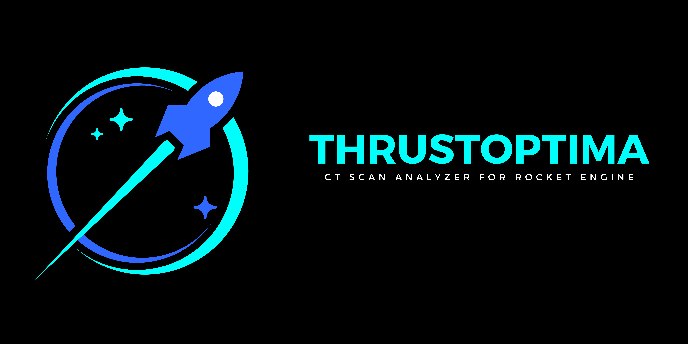

# ThrustOptima _Theory_
>By [Adam Ousmer](https://github.com/AdamOusmer) for [Space Concordia - Rocketry Division](https://spaceconcordia.ca/rocketry)

   

# Table of Contents
- [Introduction](#introduction)
- [Definitions](#definitions)
- [Medical Files (CT Scans)](#medical-files-ct-scans)
- [Computer Vision](#computer-vision)
- [Electron and Flask](#electron-and-flask)
- [References](#references)

# Introduction

# Definitions

# Medical Files (CT Scans)

# Computer Vision

# Electron and Flask

# References
